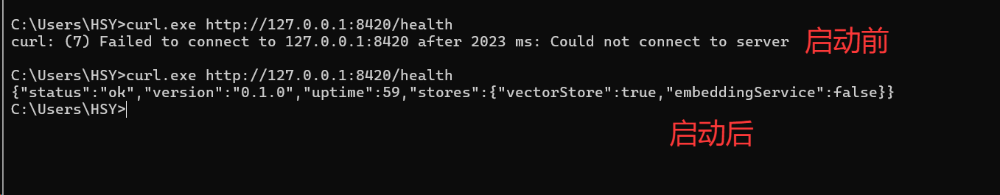
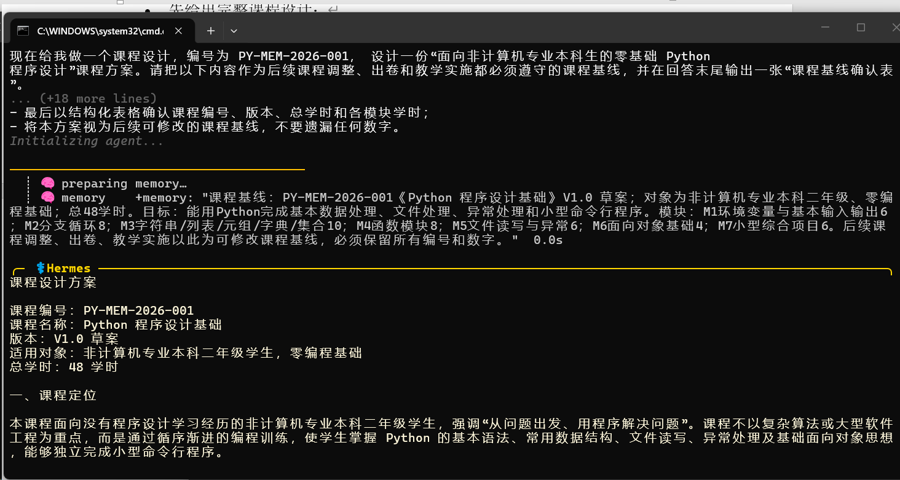
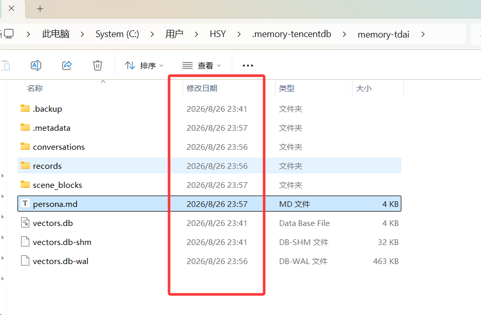
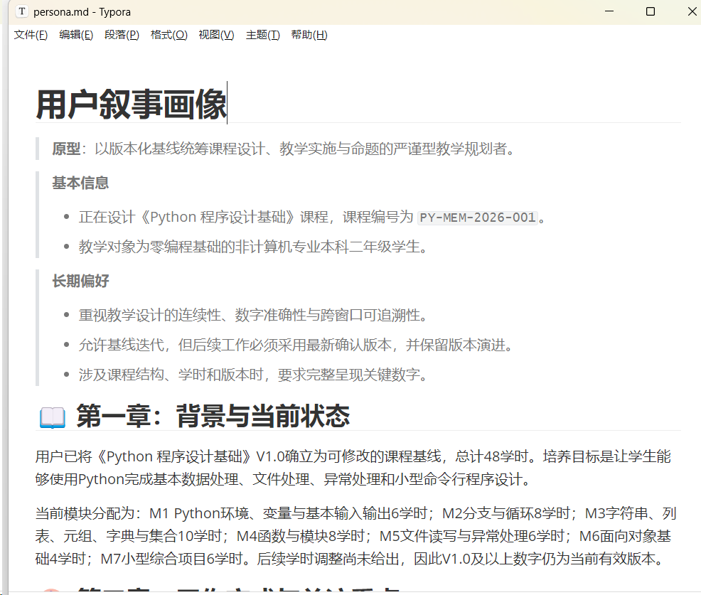
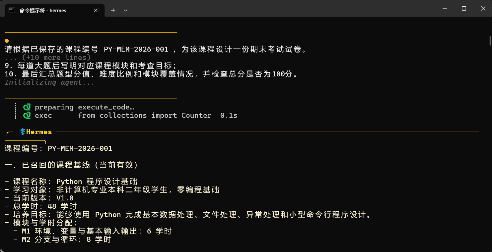

# **犀牛鸟 TencentDB-Agent-Memory 实战**

**第一周作业：记忆插件加载、对话与 L0–L3 分层记忆验证**

验收目标：完成 Hermes 对话，确认插件成功加载，并验证对话记忆已由插件持久化到 L0–L3 分层记忆。

# 一、第一周验收结果概览

| **序号** | **验收标准**                                    | **实现情况**                                              |
| -------- | ----------------------------------------------- | --------------------------------------------------------- |
| 1        | Hermes 成功对话不少于 1 轮                      | 图 2：第一窗口课程设计对话；图 5：跨窗口召回与出卷        |
| 2        | 能够证明记忆插件已加载                          | 图 1：Hermes 启动后记忆服务状态正常                       |
| 3        | 能够证明对话后记忆已落库，并形成 L0–L3 分层记忆 | 图 3：数据目录；图 4：L3 Persona；第 4 节：L0–L3 内容核验 |

# 二、实验目的与验证方案

本实验用于验证 TencentDB Agent Memory 在 Hermes 中的加载、记忆写入与跨窗口召回能力。重点检查 L0 Conversation（原始对话）、L1 Atom（结构化事实）、L2 Scenario（场景记忆）和 L3 Persona（用户画像）四个层级是否能够形成并持久化。

为避免只通过同一上下文中的短期信息判断记忆是否生效，实验设计了“课程设计—记忆写入—新窗口按课程编号召回—生成试卷”的连续业务场景。课程编号 PY-MEM-2026-001 作为跨窗口检索线索。

- 第一窗口：创建课程基线，产生可被记忆系统捕获的稳定事实、约束和后续任务。

- 落库检查：查看插件数据目录及 L0–L3 对应内容，确认记忆已经持久化。

- 第二窗口：在独立会话中仅通过课程编号请求生成期末试卷，检查是否能够召回已保存课程基线。

# 三、插件加载与 Hermes 对话验证

## 3.1 记忆插件加载验证

启动记忆服务后，对比启动前后的健康检查结果。启动后健康检查能够正常返回服务状态，说明记忆服务已成功启动，并可供 Hermes 调用。

图 1 Hermes 启动及 TencentDB Agent Memory 记忆服务状态

## 3.2 第一窗口：课程设计与记忆写入

在第一个终端窗口中创建课程编号为 PY-MEM-2026-001 的课程基线，并明确要求后续调课、出卷和教学实施均以该基线及其最新确认版本为依据。

<table>
<colgroup>
<col style="width: 100%" />
</colgroup>
<thead>
<tr class="header">
<th>
核心提示词：

课程编号：PY-MEM-2026-001；课程名称：Python 程序设计基础。

学习对象：非计算机专业本科二年级学生，零编程基础；总学时：48 学时。

总体目标：能够使用 Python 完成基本数据处理、文件处理、异常处理和小型命令行程序设计。

模块学时：M1=6，M2=8，M3=10，M4=8，M5=6，M6=4，M7=6。

当前版本：V1.0 草案。

要求：给出完整课程设计，明确各模块学习成果，并以结构化表格确认课程编号、版本、总学时和模块学时；后续将在新窗口按课程编号生成期末试卷。
</th>
</tr>
</thead>
<tbody>
</tbody>
</table>

Hermes 成功完成了课程设计回复，并在交互过程中出现记忆准备/处理提示，满足“成功对话不少于 1 轮”的第一项验收要求。

图 2 第一窗口中 Hermes 的课程设计回复

# 四、L0–L3 分层记忆落库验证

完成第一窗口对话后，进一步检查 TencentDB Agent Memory 的本地数据目录。目录中的 conversations、records、scene_blocks、persona.md 等内容在同一时间段发生更新，可作为对话后记忆已被持久化的直接证据。

图 3 TencentDB Agent Memory 分层记忆数据目录

| **层级**        | **数据位置/形式** | **本次实验中的主要内容**                                     |
|-----------------|-------------------|--------------------------------------------------------------|
| L0 Conversation | conversations     | 原始课程设计需求与 Hermes 完整回复                           |
| L1 Atom         | records           | 课程编号、版本、总学时、模块学时以及后续使用约束等结构化事实 |
| L2 Scenario     | scene_blocks      | “课程设计—调整学时—跨窗口出卷”的完整业务场景                 |
| L3 Persona      | persona.md        | 与课程设计相关的长期背景、工作方式与偏好信息                 |

## 4.1 L0：原始对话记忆

L0 保存第一窗口中的原始交互内容，包括课程设计需求以及 Hermes 的完整课程设计回复。需求中包含课程编号 PY-MEM-2026-001、学习对象、48 学时总量、M1–M7 学时分配和 V1.0 草案版本等关键事实。

## 4.2 L1：结构化事实记忆

L1 将原始对话中的关键事实进一步结构化。本次记录中可归纳出两类核心内容：

- instruction（优先级 100）：PY-MEM-2026-001 的《Python 程序设计基础》V1.0 是后续调课、出卷和教学实施所依据的可修改课程基线；总学时 48，M1–M7 分别为 6、8、10、8、6、4、6 学时；后续应按课程编号追踪，并以最新确认版本为准。

- episodic（优先级 80）：后续将调整课程学时，并在另一个独立窗口中通过课程编号生成期末试卷。

## 4.3 L2：场景记忆

L2 保存为场景文件“Python 程序设计基础-课程基线.md”，对应“课程设计—调整学时—跨窗口出卷”的连续业务场景。该场景记住课程对象、课程目标、48 学时分配以及课程编号作为跨窗口索引等信息。

## 4.4 L3：Persona 用户画像

L3 通过 persona.md 保存更长期的用户画像与工作偏好。图 4 中可以看到，画像文件记录了课程编号、课程设计背景，以及对数字准确性、版本化管理和跨窗口可追溯性的长期要求。

图 4 L3 Persona 记忆文件内容

# 五、跨窗口记忆召回验证

在新的独立窗口中，不重复输入完整课程基线，只提供课程编号 PY-MEM-2026-001，并要求 Hermes 先列出召回到的课程信息，再生成期末试卷。该步骤用于验证记忆是否能够在新会话中被重新检索，而不是仅依赖当前窗口的上下文。

## 5.1 第二窗口提示词

<table>
<colgroup>
<col style="width: 100%" />
</colgroup>
<thead>
<tr class="header">
<th>
请根据已保存的课程编号 PY-MEM-2026-001，为该课程设计一份期末考试试卷。

请先列出召回到的课程基线：课程名称、学习对象、当前版本、总学时，以及 M1 至 M7 的学时分配；如果没有召回到，请明确说明“未召回”，不要自行编造。

确认课程基线后，生成总分 100 分的期末试卷：单选题 20 分、程序阅读题 20 分、程序改错题 20 分、编程题 30 分、综合设计题 10 分；难度比例为易 30%、中 50%、难 20%。

考查范围必须与零基础 Python 课程定位及各模块学时匹配，不考查异步编程、元类、复杂装饰器、NumPy、Pandas、Web 框架等超出课程基线的内容。

每道大题注明对应模块和考查目标，并在最后检查题型分值、难度比例、模块覆盖情况和总分。
</th>
</tr>
</thead>
<tbody>
</tbody>
</table>

## 5.2 跨窗口召回结果

第二窗口中，Hermes 能够根据课程编号召回课程名称、学习对象、V1.0 版本、48 学时总量及模块学时等课程基线信息，并据此继续生成针对性的期末试卷。该结果进一步说明前一窗口产生的课程记忆已经具备跨窗口检索与复用能力。

图 5 第二窗口基于课程记忆生成期末试卷
