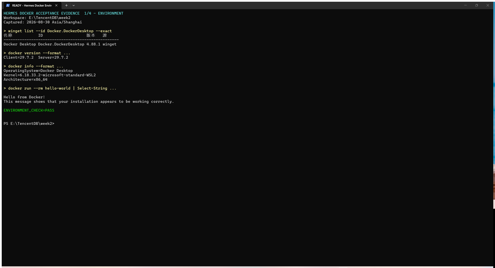
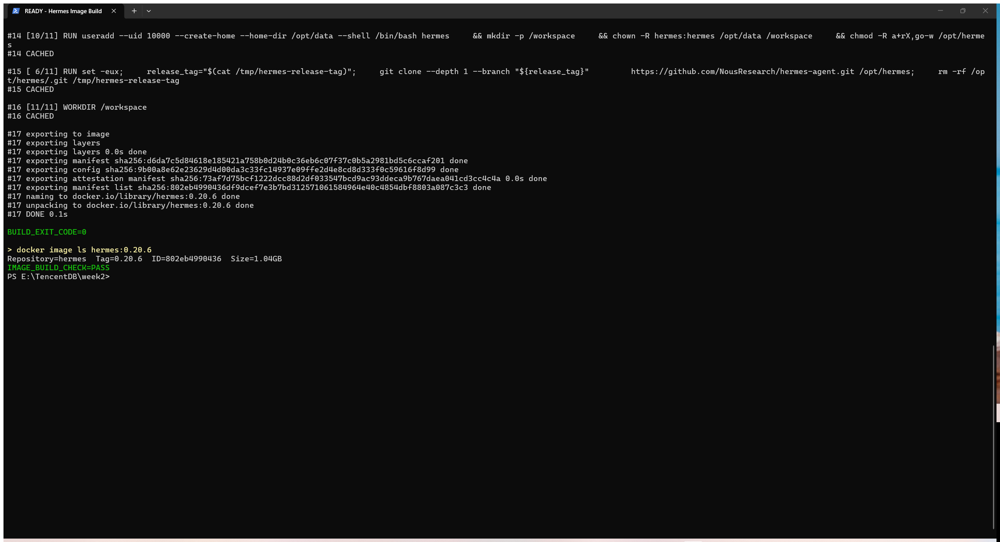

# Hermes Agent Docker 镜像构建流程

## 1. Docker 环境验证

安装好docker，执行 `hello-world` 容器后，终端返回 `Hello from Docker!` 和安装工作正常的确认信息，说明 Docker Client、Docker Engine、镜像拉取和容器运行链路均正常。



## 2. Dockerfile 实现说明

### 2.1 基础镜像与 Node.js

Dockerfile 使用作业指定的 Debian 12 基础镜像：

```dockerfile
FROM node:22-bookworm-slim
```

Node.js 由该基础镜像提供。构建过程中还会执行版本检查，版本低于 `22.16.0` 时立即终止构建。本次容器内实测版本为 `v22.23.2`。

### 2.2 Hermes 版本参数化

Hermes 版本没有设置默认值，必须在构建时传入：

```dockerfile
ARG HERMES_VERSION
```

同时Dockerfile 对版本参数执行以下校验：

- 未传入 `HERMES_VERSION` 时给出明确错误并终止构建。
- 输入格式必须符合 `0.x.x`。
- 只有源码版本与输入版本完全一致时才允许继续构建。

例，本次输入的 `0.20.6` 最终解析到官方源码标签 `v2026.8.27`。

### 3.3 干净镜像

按照要求，镜像只安装 Hermes 核心及其必要运行依赖，没有安装 其余的插件，包括TencentDB记忆插件。

## 4. 镜像构建过程

在工作目录执行以下命令，通过arg指定hermes版本：

```powershell
docker build --progress=plain --build-arg HERMES_VERSION=0.20.6 -t hermes:0.20.6 .
```

首次完整构建日志已保存到 [`docker-build-0.20.6.log`](./docker-build-0.20.6.log)。日志包含基础镜像拉取、版本标签解析、源码克隆、Python 虚拟环境创建、Hermes 核心安装、版本校验和镜像导出过程。

终端截图中的复验构建复用了首次构建产生的有效缓存，但仍重新执行了完整的 Docker 构建流程并成功导出镜像。终端显示：

- `BUILD_EXIT_CODE=0`
- 镜像名称为 `hermes:0.20.6`
- 镜像显示大小约为 `1.04GB`
- `IMAGE_BUILD_CHECK=PASS`

使用 HERMES_VERSION=0.20.6 实际执行 docker build，镜像成功导出并标记为 hermes:0.20.6：



## 5. 版本一致性与镜像内容验证

### 5.1 Hermes 命令行版本

执行：

```powershell
docker run --rm hermes:0.20.6 --version
```

实测输出：

```text
Hermes Agent v0.20.6 (2026.8.27)
```


## 6. Hermes 容器启动验证

为确认镜像不仅能够查询版本，而且能够真正启动 Hermes，使用 TTY 在后台启动容器：

```powershell
docker run -dit --name hermes-smoke hermes:0.20.6
```

容器启动后执行 `docker inspect`、`docker ps`、`docker top` 和 `docker logs`。验证结果如下：

- 容器状态为 `Running=true`。
- `docker ps` 显示容器处于 `Up` 状态。
- 容器主进程为 `/opt/hermes/.venv/bin/python /opt/hermes/.venv/bin/hermes --cli`。
- 容器日志显示 `Hermes Agent v0.20.6` 交互界面。
- 进程未异常退出，启动验收结果为 `HERMES_STARTUP_CHECK=PASS`。
- 配置了大模型API之后，显示了hermes界面，对话完整，证明链路打通，hermes正常提供服务。


